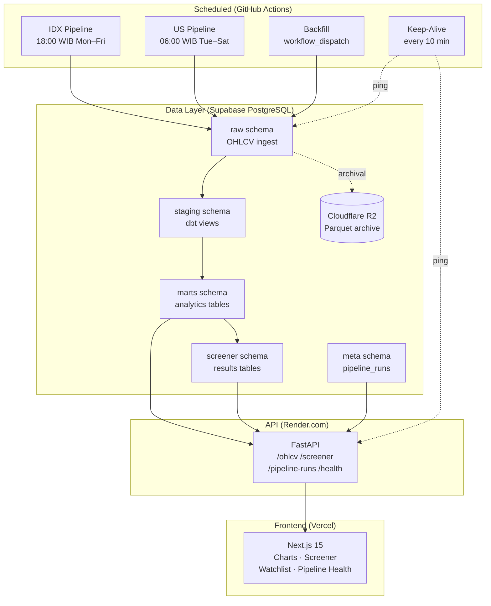

# Monarqhs Analytics

> Personal investor/trader analytics dashboard for IDX and US markets — built as a production-grade portfolio project with a $0/month infrastructure constraint.

[](https://github.com/Monarqhs/Personal-Invest-Dashboard-Analytics/actions/workflows/ci.yml)
[](LICENSE)

**[Live Demo →](#)** | **[API Docs →](#)** | **[Architecture →](#architecture)**

---

## What This Is

A personal dashboard that:
- Ingests daily OHLCV data for IDX (LQ45 subset) and US market stocks/ETFs
- Runs a custom screener engine producing daily/weekly/monthly buy-sell signals
- Displays TradingView-style candlestick charts and screener results
- Shows pipeline health (run history, success/failure, duration) — no Airflow UI needed

Built for two audiences:
1. **Me** — an active investor/trader who wants a single view of my watchlist
2. **Recruiters** — a showcase of end-to-end data + software engineering skills

---

## Architecture



---

## Stack

| Layer | Technology | Why |
|---|---|---|
| Frontend | Next.js 15 + TypeScript + Tailwind → **Vercel** | SSR + edge caching; 100 GB free bandwidth |
| API | FastAPI + SQLAlchemy → **Render.com** | 512 MB free; auto-sleep mitigated by keep-alive |
| Database | **Supabase** PostgreSQL | Real Postgres; 500 MB free; RLS ready |
| Orchestration | **GitHub Actions** cron | Airflow requires 1–2 GB RAM; no free tier supports it |
| Transforms | **dbt-core** (runs in GH Actions) | Staging → intermediate → marts pattern |
| Screener | Python + pandas + pandas-ta | Plugin architecture; private formulas not in repo |
| Archival | **Cloudflare R2** (Parquet) | 10 GB free; raw data older than 6 months |
| Monitoring | **Telegram Bot** webhook | Free; alerts on pipeline failure |

**Total monthly cost: $0**

---

## Why GitHub Actions Instead of Airflow

Airflow is the industry-standard orchestrator and it would look great on this project's resume. I chose GitHub Actions instead — here's the honest reasoning:

- Airflow at idle uses ~1–2 GB RAM. No free hosting tier (Render, Fly.io, Railway) supports this without payment.
- GitHub Actions gives unlimited minutes on public repos and native secret management.
- The business constraint of $0/month is real and made this the right call.

The pipeline code is structured as explicit DAG-style tasks (`extract → load_raw → transform → screen → notify`). Each task is an isolated Python module. Migrating to Airflow means wrapping each task function with `@task` — estimated 1–2 days of work. This is documented in [ADR-002](docs/adr/ADR-002-github-actions-orchestrator.md).

---

## Architecture Decision Records

| ADR | Decision |
|---|---|
| [ADR-001](docs/adr/ADR-001-free-tier-hosting.md) | Free-tier hosting strategy and fallback options |
| [ADR-002](docs/adr/ADR-002-github-actions-orchestrator.md) | GitHub Actions instead of Airflow |
| [ADR-005](docs/adr/ADR-005-auth-ready-without-auth-enforced.md) | Auth-ready architecture without enforcing auth in MVP |
| [ADR-006](docs/adr/ADR-006-tiered-storage.md) | Hot Postgres + cold R2 Parquet archival |
| [ADR-007](docs/adr/ADR-007-shared-package-ssot.md) | Shared package as cross-language type SSOT |

---

## Local Development

### Prerequisites
- Docker + Docker Compose
- Python 3.12+
- Node.js 20+ + pnpm 9+
- [uv](https://docs.astral.sh/uv/) (`pip install uv`)

### Start the stack

```bash
cp .env.example .env
docker compose up
```

Services:
- **Postgres** → `localhost:5432`
- **API** → `http://localhost:8000` (docs: `/docs`)
- **Frontend** → `http://localhost:3000`

### Regenerate TypeScript types

```bash
pnpm codegen
```

### Run tests

```bash
# Python
uv pip install -e packages/shared/python -e "apps/api[dev]"
pytest apps/api/tests

# Frontend
cd apps/web && pnpm test
```

---

## Project Structure

```
/apps
  /api              FastAPI service
  /web              Next.js 15 frontend
/packages
  /shared
    /python         Pydantic models + abstract interfaces (SSOT)
    /typescript     Auto-generated API types + shared constants
    /scripts        codegen.sh
  /pipelines        Ingestion tasks + screener engine
  /dbt              dbt project (staging → intermediate → marts)
/infra              docker-compose, deployment scripts
/docs/adr           Architecture Decision Records
/.github/workflows  CI + scheduled pipelines
```

---

## Deployment

_Detailed deployment guide coming in Phase 8._

| Service | Platform | Status |
|---|---|---|
| Frontend | Vercel | 🔧 Phase 1 |
| API | Render.com | 🔧 Phase 1 |
| Database | Supabase | 🔧 Phase 1 |

---

## Lessons Learned

_Populated as the project progresses._

---

## License

MIT © 2026 [Monarqhs](https://github.com/Monarqhs)
